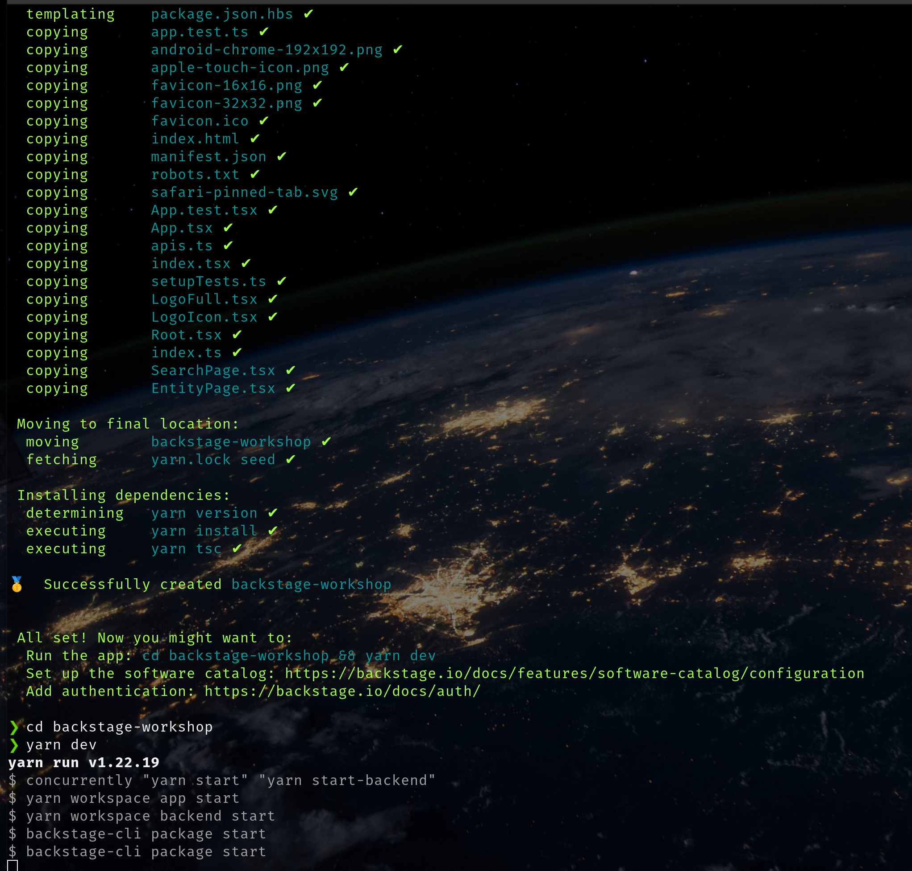

# Gestão de configuração
## Introdução
O Backstage é uma plataforma de desenvolvedores open source criada pela equipe de engenharia da Spotify. Ele é projetado para centralizar ferramentas, serviços, documentação e recursos relacionados ao desenvolvimento de software em um único portal unificado. A plataforma ajuda as equipes a organizar e gerenciar seus projetos de software de maneira eficiente, oferecendo uma experiência consistente para os desenvolvedores.

## Processo de compilação e execução
### Setup inicial
Para a execução bem sucedida do deploy do Backstage, os pré-requisitos são:
- Instalação do NVM
- Instalação do Yarn
- Instalação do Docker
- Instalação do Kind e Kubectl

Inicialmente, é necessário instalar e configurar o NVM, para que a versão 18 do node seja utilizada:
```bash
# Instalação NVM
curl -o- https://raw.githubusercontent.com/nvm-sh/nvm/v0.39.3/install.sh | bash

# Instalação Node 18
nvm install 18

# Utilização do Node 18
nvm use 18

# Setup do Node 18 como versão Default
nvm alias default 18
```

Depois disso, é necessário instalar o Yarn
```bash
# Instalação do Yarn
npm install --global yarn

# Setup do Yarn na versão 1.22.19
yarn set version 1.22.19

# Verificação da versão do Yarn
yarn --version
```

Para instalar o Docker, siga o indicado no link de acordo com seu SO: <a href="https://docs.docker.com/engine/install/">Install Docker Engine</a>

Para instalar o Kind, é necessário seguir os seguintes passos:
```bash
# Para AMD x86-64
[ $(uname -m) = x86_64 ] && curl -Lo ./kind https://kind.sigs.k8s.io/dl/v0.20.0/kind-linux-amd64
chmod +x ./kind
sudo cp ./kind /usr/local/bin/kind
rm -rf kind

# Verificação da versão do Kind
kind --version
```

Por fim, é necessário instalar o kubectl:
```bash
# Instalação da release mais recente(para AMD x86-64)
curl -LO "https://dl.k8s.io/release/$(curl -L -s https://dl.k8s.io/release/stable.txt)/bin/linux/amd64/kubectl"

# Instalação o arquivo checksum para validar o binário(opcional)
curl -LO "https://dl.k8s.io/release/$(curl -L -s https://dl.k8s.io/release/stable.txt)/bin/linux/amd64/kubectl.sha256"

# Validação do binário
echo "$(cat kubectl.sha256)  kubectl" | sha256sum --check # Se for válido o output deve ser -> kubectl: OK

# Instalação do kubectl
sudo install -o root -g root -m 0755 kubectl /usr/local/bin/kubectl

# Verificação da versão do kubectl
kubectl version --client
```

### Criação da aplicação Backstage
```bash
npx @backstage/create-app@latest
```

Selecione o nome da aplicação e o output desejado deve ser parecido com isso:


Navegue até a aplicação e execute o comando `yarn dev` para testar ela rodando localmente:


É provável que por não ter sido estabelecido nenhum tipo de autenticação, deverá abrir em seu navegador uma tela parecida com essa, que inclui um erro de autenticação:


Nesse sentido, é importante gerar um token por meio do comando:
```bash
openssl rand -base64 32
```

Com o token gerado, altere os arquivos `app-config.production.yaml` e `app-config.yaml` inserindo o backend.auth:


Além disso, é possível alterar o nome da aplicação e org no `app-config.yaml`, ao rodar localmente novamente, deve-se ter algo parecido com isso:


### Execução do Backstage no Kubernetes
Nessa etapa, é necessário efetuar o build da imagem  Docker da aplicação:
```bash
# No diretório da aplicação, execute os comandos para efetuar o build da aplicação
yarn install --frozen-lockfile
yarn tsc
yarn build:backend

# Build da imagem
docker image build . -f packages/backend/Dockerfile --tag backstage:1.0.0
```


Agora é necessário criar um registry/kind cluster e fazer o upload da imagem no cluster:
```bash
# Criação do cluster
kind create cluster --name local-single-node

# Upload da imagem no cluster
kind load docker-image backstage:1.0.0 --name local-single-node
```


Depois disso, é necessário fazer o deploy do postgres, o exemplo mostra o caso de uma instância local, para isso, é necessário seguir os seguintes passos:
```bash
# Clone do repositório que possui os resources
git clone https://github.com/guymenahem/how-to-devops-tools.git

# Criação do namespace backstage
kubectl create ns backstage

# Navegue até o diretório how-to-devops-tools/backstage
# Criação dos recursos do Postgres
kubectl apply -f postgres-resources

# Verificação do acesso ao Postgres
export PG_POD=$(kubectl get pods -n backstage -o=jsonpath='{.items[0].metadata.name}')

kubectl exec -it --namespace=backstage $PG_POD -- /bin/bash
psql -U $POSTGRES_USER

# \q e exit para sair
```


Agora é necessário atualizar a autenticação por meio de um token de autorização do Github antes de concluir o deploy em Kubernetes, pode ser feito por meio do editor de sua preferência(e.g: vim, nano). Nesse caso, o nano foi utilizado para alterar o token no arquivo bs-secret.yaml, dentro do repositório backstage-resources.


### Deploy no Kubernetes
Feito isso, o deploy pode ser feito por meio dos seguintes comandos:
```bash
# Navegue até o diretório how-to-devops-tools/backstage
# Aplique os recursos do backstage
kubectl apply -f backstage-resources

# Verifique a instância em execução
kubectl port-forward --namespace=backstage svc/backstage 8080:80
```


### Aplicação em execução
Ao abrir a porta <a href="http://127.0.0.1:8080/">http://127.0.0.1:8080/</a>, é esperado ter algo parecido com isso


